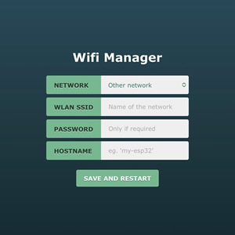
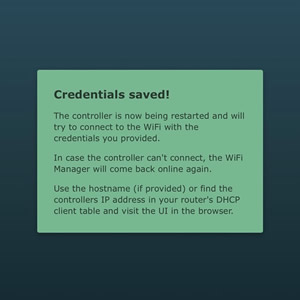

# Wifi Manager for ESP32

## Why did this come about

When you build an ESP32 DIY device for your home, you can often just hardcode your wifi credentials and that is the end of it. In case you decide to publish your project you now have to make sure not to publish those credentials. This was the reason that I wanted to make it easy for myself to do a quick project but at the same time have it handle wifi credentials like most hardware you buy in the store does.

<div align="center">
    <br>
    <a href="./assets/manager.jpg"></a>
    &nbsp;&nbsp;&nbsp;&nbsp;&nbsp;&nbsp;&nbsp;&nbsp;
    <a href="./assets/confirmation.jpg"></a>
    <br>
    <br>
</div>

With very few lines of code you'll have your own wifi manager up and running:

```c++
#include "WifiManager.h"

WifiManager wifiManager;

void setup() {
    // Attempts to connect to Wifi using stored credentials
    bool connected = wifiManager.connectToWifi();

    if (!connected) {
        // If unable to connect on boot, the management server is started
        // so new credentials can be set using the web interface.
        wifiManager.startManagementServer();
    }
}

void loop() {
    // Continously checks if we are connected on WIFI. The wifi manager
    // will automatically reconnect if connection is dropped.
    wifiManager.check();

    // Do your main application loop here.
    // ...
}
```

## Features
### Build-in interface
Once you start the management server you will be able to access the wifi `WIFI-MANAGER`. You can give it a custom SSID by providing it as a parameter to the `.startManagementServer()` function. After connecting to the wifi, access your ESP32 on `http://192.168.4.1` to setup connection to your home wifi.

### Scans available networks
It will scan for available networks nearby and present them in a dropdown for you to choose from. In case your SSID is not on the list (out of range, hidden SSID, etc) you can choose to specify a custom SSID by choosing `Other network` in the dropdown.

### Automatic reconnect
In case the ESP32 is disconnected from the wifi it will automatically try to reconnect.

### Support for gzip response
If the request has a `Accept-Encoding` header set with support for gzip, it will send a compressed version of the wifi manager. The UI is 7.5kb in it original state. When minimized it is reduced to 4.4kb and when compressed it comes down to only 1.8kb.

### Custom UI
You can override the default UI by putting your own code in `/wifi-manager` on the SPIFFS. It will look for an index.html and serve that if it exists. Refer to `/interface/src/index.html` to see how you could build your own UI.

_Note:_ Custom UIs does not have support for gzipped responses, but remember to at least minify your html, stylesheets and javascript. It will definitely help.

## Improvements

### Automatically update Data.cpp
Currently updating the default UI is a manual step involving editing the `index.html` in /interface and building a new set of variables for `Data.cpp`. It would be nice if this was done automatically in the build process somehow, but it is not something I have spend any time on.

It would be a great improvement going forward as it would lower the risk of doing it wrong or forgetting copying either the compressed or uncompressed data getting weird results depending on the browser used.

## Known issues
When trying to connect to a wifi that is not available, it is not scanning available correctly. The list is empty. Steps to reproduce:
 - Get wifi manager running on a clean esp and goto the management page
 - Confirm you have a list of available networks
 - Input invalid wifi credentials and save
 - ESP will restart and fail connecting and start wifi manager again
 - Goto management page again and confirm the list of available networks is now empty

If saving credentials fails, you are not informed and spinner stays forever. Steps to reproduce:
 - Access wifi managers page
 - Turn off ESP
 - Click save and restart
 - Spinner spins forever
